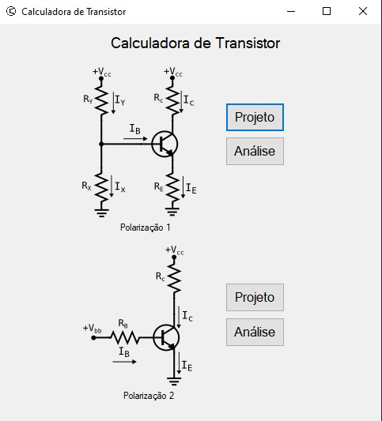
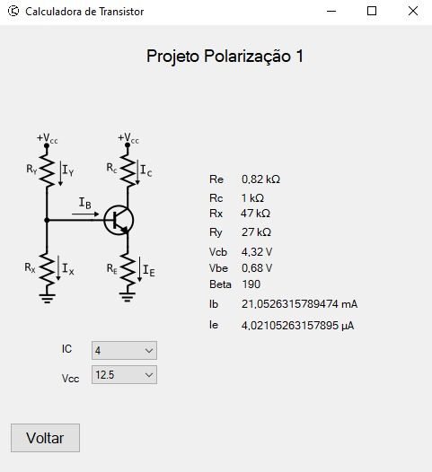
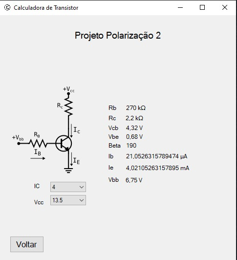
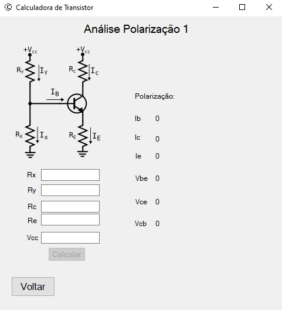

# Transistor Calculator

## Equipe

Ten Guilherme da Silva *Pereira* - 22104

Al Maria *Eduarda Sandre* Marques - 21042

## Conceito

Compreender transistores é fundamental em nossa era digital. Esses minúsculos dispositivos de semicondutores são a espinha dorsal da eletrônica moderna, permitindo o funcionamento de smartphones, computadores e uma infinidade de dispositivos eletrônicos. Conhecer sua operação é crucial para engenheiros e entusiastas, pois ajuda na criação de circuitos mais eficientes e na solução de problemas.

Ter um programa que auxilie na análise e no projeto de circuitos com transistores é igualmente crucial. Facilita a modelagem de sistemas complexos, economizando tempo e recursos. Além disso, torna a tecnologia mais acessível, permitindo que pessoas com diferentes níveis de conhecimento explorem as possibilidades dos transistores.

## Função

O programa oferece uma funcionalidade valiosa, permitindo ao usuário escolher entre dois tipos de polarização de transistores. Selecione um tipo, a opção projeto e o ponto de polarização para o programa calcular as resistências com valores comerciais. Além disso, caso o usuário prefira, pode definir os valores de resistências e as tensões de entrada e o programa calculará  as correntes e tensões, simplificando assim o processo de projeto e análise de circuitos com transistores.

## Tutorial

A calculadora de transistor oferece uma interface intuitiva que facilita a navegação do usuário de maneira eficaz. Na tela inicial, o usuário escolhe o tipo de polarização e a atividade desejada, seja um projeto ou uma análise. Após a seleção, o usuário é direcionado para uma nova página, onde tem à sua disposição uma série de recursos para auxiliá-lo no processo.

A partir desse ponto, o usuário pode optar por voltar à tela anterior ou inserir os dados necessários para realizar os cálculos. Os valores a serem inseridos são selecionados a partir de uma lista presente em uma caixa de seleção ou em uma caixa onde coloca valores numéricos, tornando o processo de entrada de informações simples e prático. Após a introdução dos valores os resultados calculados são imediatamente exibidos em suas respectivas caixas, proporcionando ao usuário uma resposta rápida e precisa.

Além disso, o usuário tem a flexibilidade de retornar à página anterior a qualquer momento durante esse processo, garantindo uma experiência de uso fluida e amigável. A calculadora de transistor se destaca por sua acessibilidade e facilidade de uso, tornando a análise e o projeto de circuitos eletrônicos mais eficientes e eficazes para os seus usuários.
